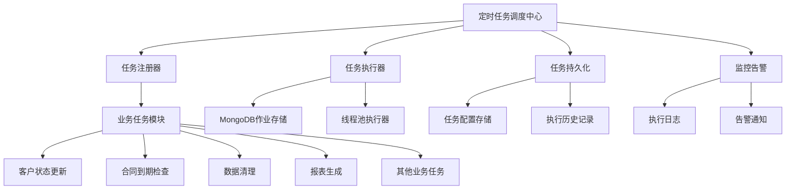

# 通用定时任务模块设计方案

## 📋 概述

本文档描述了一个通用的定时任务模块设计方案，旨在为电力交易辅助决策系统提供一个标准化的、可扩展的、易于维护的定时任务管理框架。

## 🎯 设计目标

1. **标准化**: 提供统一的任务定义、注册和执行接口
2. **可扩展**: 支持业务模块快速添加新的定时任务
3. **可靠性**: 确保任务执行的稳定性和数据一致性
4. **监控性**: 提供完整的任务执行监控和告警机制
5. **容错性**: 处理任务执行失败、系统重启等异常情况

## 🏗️ 架构设计

### 系统架构图



### 目录结构

```
webapp/
├── services/
│   ├── __init__.py
│   ├── scheduler_service.py      # 核心调度服务
│   ├── task_registry.py          # 任务注册器
│   ├── task_persistence.py       # 任务持久化管理
│   ├── task_monitor.py          # 任务监控服务
│   └── task_executor.py         # 任务执行器
├── tasks/                        # 各业务模块的具体任务
│   ├── __init__.py
│   ├── base_task.py            # 任务基类
│   ├── customer/               # 客户相关任务
│   │   ├── __init__.py
│   │   ├── status_update.py   # 客户状态更新
│   │   └── contract_check.py  # 合同状态检查
│   ├── contract/               # 合同相关任务
│   │   ├── __init__.py
│   │   ├── expire_check.py    # 合同到期检查
│   │   └── auto_renewal.py    # 合同自动续期
│   ├── data/                   # 数据相关任务
│   │   ├── __init__.py
│   │   ├── cleanup.py         # 数据清理
│   │   ├── backup.py          # 数据备份
│   │   └── archive.py         # 数据归档
│   └── report/                 # 报表相关任务
│       ├── __init__.py
│       ├── daily_report.py    # 日报生成
│       ├── monthly_report.py  # 月报生成
│       └── annual_report.py   # 年报生成
├── api/
│   └── v1_scheduler.py         # 定时任务管理API接口
└── config/
    └── scheduler_config.py     # 调度器配置
```

## 🔧 核心组件设计

### 1. 任务基类 (BaseTask)

```python
from abc import ABC, abstractmethod
from typing import Dict, Any, Optional, List
from datetime import datetime
from enum import Enum

class TaskStatus(Enum):
    """任务状态枚举"""
    PENDING = "pending"      # 待执行
    RUNNING = "running"      # 执行中
    SUCCESS = "success"      # 执行成功
    FAILED = "failed"        # 执行失败
    SKIPPED = "skipped"      # 已跳过

class TaskPriority(Enum):
    """任务优先级枚举"""
    LOW = 1
    NORMAL = 2
    HIGH = 3
    CRITICAL = 4

class BaseTask(ABC):
    """定时任务基类"""

    def __init__(self):
        self.task_id: Optional[str] = None
        self.execution_context: Dict[str, Any] = {}

    @property
    @abstractmethod
    def task_name(self) -> str:
        """任务名称，必须唯一"""
        pass

    @property
    @abstractmethod
    def task_description(self) -> str:
        """任务描述"""
        pass

    @property
    @abstractmethod
    def task_category(self) -> str:
        """任务分类"""
        pass

    @property
    def task_tags(self) -> List[str]:
        """任务标签，用于分类和搜索"""
        return []

    @property
    def task_priority(self) -> TaskPriority:
        """任务优先级"""
        return TaskPriority.NORMAL

    @property
    def default_schedule(self) -> Dict[str, Any]:
        """默认调度配置"""
        return {
            "trigger": "cron",
            "hour": 2,
            "minute": 0,
            "misfire_grace_time": 300,
            "max_instances": 1
        }

    @property
    def retry_config(self) -> Dict[str, Any]:
        """重试配置"""
        return {
            "max_retries": 3,
            "retry_delay": 60,  # 秒
            "backoff_factor": 2
        }

    @abstractmethod
    async def execute(self, **kwargs) -> Dict[str, Any]:
        """
        执行任务的核心逻辑

        Returns:
            Dict[str, Any]: 执行结果
                - success: bool - 是否成功
                - message: str - 执行信息
                - data: Any - 返回数据
                - statistics: Dict - 执行统计信息
        """
        pass

    def validate_execution_environment(self) -> bool:
        """验证任务执行环境"""
        return True

    def before_execution(self) -> None:
        """执行前的准备工作"""
        pass

    def after_execution(self, result: Dict[str, Any]) -> None:
        """执行后的清理工作"""
        pass

    def on_failure(self, error: Exception) -> None:
        """执行失败时的处理"""
        pass
```

### 2. 任务注册器 (TaskRegistry)

```python
class TaskRegistry:
    """任务注册器 - 单例模式"""

    def __init__(self):
        self._tasks: Dict[str, BaseTask] = {}
        self._auto_register()

    def register_task(self, task_class: type, task_config: Dict[str, Any] = None) -> None:
        """
        注册任务

        Args:
            task_class: 任务类，必须继承自BaseTask
            task_config: 任务配置（可选）
        """
        if not issubclass(task_class, BaseTask):
            raise ValueError(f"任务类 {task_class.__name__} 必须继承自 BaseTask")

        task = task_class()
        if task_config:
            task.execution_context.update(task_config)

        self._tasks[task.task_name] = task

    def get_task(self, task_name: str) -> Optional[BaseTask]:
        """获取任务实例"""
        return self._tasks.get(task_name)

    def list_tasks(self, category: str = None, tags: List[str] = None) -> List[BaseTask]:
        """
        列出任务

        Args:
            category: 任务分类过滤
            tags: 任务标签过滤

        Returns:
            符合条件的任务列表
        """
        tasks = list(self._tasks.values())

        if category:
            tasks = [task for task in tasks if task.task_category == category]

        if tags:
            tasks = [task for task in tasks
                    if any(tag in task.task_tags for tag in tags)]

        return tasks

    def _auto_register(self) -> None:
        """自动注册所有任务"""
        # 自动发现并注册 tasks 目录下的所有任务
        self._discover_tasks()

    def _discover_tasks(self) -> None:
        """自动发现任务类"""
        # 实现自动发现逻辑
        pass

# 全局单例
task_registry = TaskRegistry()
```

### 3. 调度服务 (SchedulerService)

```python
from apscheduler.schedulers.background import BackgroundScheduler
from apscheduler.jobstores.mongodb import MongoDBJobStore
from apscheduler.executors.pool import ThreadPoolExecutor
from apscheduler.events import EVENT_JOB_EXECUTED, EVENT_JOB_ERROR, EVENT_JOB_MISSED
from datetime import datetime, timedelta

class SchedulerService:
    """通用调度服务"""

    def __init__(self, db):
        self.db = db
        self.scheduler = None
        self.task_persistence = TaskPersistence(db)
        self.task_monitor = TaskMonitor(db)
        self.task_executor = TaskExecutor(db)
        self._init_scheduler()

    def _init_scheduler(self) -> None:
        """初始化调度器"""
        # MongoDB 持久化任务状态
        jobstores = {
            'default': MongoDBJobStore(
                client=db.client,
                database='exds',
                collection='scheduler_jobs'
            )
        }

        # 线程池执行器
        executors = {
            'default': ThreadPoolExecutor(max_workers=20)
        }

        # 作业默认配置
        job_defaults = {
            'coalesce': True,           # 合并多个相同的作业
            'max_instances': 3,         # 最大实例数
            'misfire_grace_time': 300   # 错过执行时间宽限
        }

        self.scheduler = BackgroundScheduler(
            jobstores=jobstores,
            executors=executors,
            job_defaults=job_defaults,
            timezone='Asia/Shanghai'
        )

        # 添加事件监听
        self.scheduler.add_listener(
            self._job_executed_listener,
            EVENT_JOB_EXECUTED | EVENT_JOB_ERROR | EVENT_JOB_MISSED
        )

    def start(self) -> None:
        """启动调度器"""
        try:
            # 注册所有任务
            self._register_all_tasks()

            # 启动调度器
            self.scheduler.start()

            # 启动时检查错过的任务
            self._check_missed_tasks()

            print("定时任务调度器启动成功")

        except Exception as e:
            print(f"启动定时任务调度器失败: {str(e)}")
            raise

    def stop(self) -> None:
        """停止调度器"""
        if self.scheduler.running:
            self.scheduler.shutdown()
            print("定时任务调度器已停止")

    def add_task(self, task_name: str, schedule_config: Dict[str, Any]) -> bool:
        """
        动态添加任务

        Args:
            task_name: 任务名称
            schedule_config: 调度配置

        Returns:
            是否添加成功
        """
        try:
            task = task_registry.get_task(task_name)
            if not task:
                raise ValueError(f"任务 {task_name} 未找到")

            self.scheduler.add_job(
                func=self._execute_task_wrapper,
                args=[task],
                id=task_name,
                name=task.task_description,
                replace_existing=True,
                **schedule_config
            )

            # 保存调度配置
            self.task_persistence.save_task_schedule(task_name, schedule_config)

            return True

        except Exception as e:
            print(f"添加任务 {task_name} 失败: {str(e)}")
            return False

    def remove_task(self, task_name: str) -> bool:
        """移除任务"""
        try:
            if self.scheduler.get_job(task_name):
                self.scheduler.remove_job(task_name)

            self.task_persistence.remove_task_schedule(task_name)
            return True

        except Exception as e:
            print(f"移除任务 {task_name} 失败: {str(e)}")
            return False

    def pause_task(self, task_name: str) -> bool:
        """暂停任务"""
        try:
            self.scheduler.pause_job(task_name)
            return True
        except Exception:
            return False

    def resume_task(self, task_name: str) -> bool:
        """恢复任务"""
        try:
            self.scheduler.resume_job(task_name)
            return True
        except Exception:
            return False

    def get_job_info(self, task_name: str = None) -> List[Dict[str, Any]]:
        """获取任务信息"""
        jobs = []
        for job in self.scheduler.get_jobs():
            if task_name and job.id != task_name:
                continue

            job_info = {
                "id": job.id,
                "name": job.name,
                "next_run_time": job.next_run_time.isoformat() if job.next_run_time else None,
                "trigger": str(job.trigger),
                "executor": job.executor,
                "max_instances": job.max_instances
            }
            jobs.append(job_info)

        return jobs

    async def _execute_task_wrapper(self, task: BaseTask) -> Dict[str, Any]:
        """任务执行包装器"""
        start_time = datetime.now()
        execution_id = f"{task.task_name}_{int(start_time.timestamp())}"

        try:
            # 记录开始执行
            await self.task_monitor.task_started(
                task.task_name,
                execution_id,
                start_time
            )

            # 验证执行环境
            if not task.validate_execution_environment():
                raise Exception("任务执行环境验证失败")

            # 执行前准备
            task.before_execution()

            # 执行任务
            result = await self.task_executor.execute_task(task, execution_id)

            # 执行后清理
            task.after_execution(result)

            # 记录执行成功
            await self.task_monitor.task_completed(
                task.task_name,
                execution_id,
                start_time,
                result
            )

            return result

        except Exception as e:
            # 记录执行失败
            error_info = {
                "error_type": type(e).__name__,
                "error_message": str(e),
                "traceback": traceback.format_exc()
            }

            await self.task_monitor.task_failed(
                task.task_name,
                execution_id,
                start_time,
                error_info
            )

            # 调用失败处理
            task.on_failure(e)

            # 返回失败结果
            return {
                "success": False,
                "message": f"任务执行失败: {str(e)}",
                "error": error_info,
                "execution_time": (datetime.now() - start_time).total_seconds()
            }

    def _job_executed_listener(self, event) -> None:
        """作业执行事件监听器"""
        if event.exception:
            print(f"任务 {event.job_id} 执行失败: {event.exception}")
            # 发送告警通知
            self.task_monitor.send_alert(
                f"任务执行失败",
                f"任务 {event.job_id} 执行过程中发生错误: {event.exception}",
                "error"
            )
        else:
            print(f"任务 {event.job_id} 执行成功")
```

## 📊 业务任务示例

### 客户状态更新任务

```python
class CustomerStatusUpdateTask(BaseTask):
    """客户状态自动更新任务"""

    @property
    def task_name(self) -> str:
        return "customer_status_auto_update"

    @property
    def task_description(self) -> str:
        return "客户状态自动更新任务：根据合同执行时间和系统日期自动更新客户状态"

    @property
    def task_category(self) -> str:
        return "customer"

    @property
    def task_tags(self) -> List[str]:
        return ["status", "auto", "customer"]

    @property
    def default_schedule(self) -> Dict[str, Any]:
        return {
            "trigger": "cron",
            "hour": 2,
            "minute": 0,
            "misfire_grace_time": 300,
            "max_instances": 1
        }

    async def execute(self, **kwargs) -> Dict[str, Any]:
        from webapp.services.customer_service import CustomerService
        from webapp.tools.mongo import DATABASE

        service = CustomerService(DATABASE)

        try:
            # 获取所有需要状态检查的客户
            customers = service.get_customers_needing_status_update()

            update_count = 0
            error_count = 0
            errors = []

            for customer in customers:
                try:
                    # 计算应有的状态
                    new_status = service.calculate_customer_status(customer)

                    # 如果状态需要更新
                    if new_status != customer.get("status"):
                        service.update_customer_status(
                            customer["_id"],
                            customer.get("status"),
                            new_status,
                            "auto_status_update"
                        )
                        update_count += 1

                except Exception as e:
                    error_count += 1
                    errors.append({
                        "customer_id": str(customer["_id"]),
                        "customer_name": customer.get("user_name"),
                        "error": str(e)
                    })

            return {
                "success": True,
                "message": "客户状态更新完成",
                "statistics": {
                    "total_checked": len(customers),
                    "status_updates": update_count,
                    "errors": error_count,
                    "error_details": errors
                },
                "data": {
                    "updated_customers": update_count
                }
            }

        except Exception as e:
            return {
                "success": False,
                "message": f"客户状态更新失败: {str(e)}",
                "statistics": {
                    "total_checked": 0,
                    "status_updates": 0,
                    "errors": 1
                }
            }
```

## 🔍 监控和告警

### 任务监控服务

```python
class TaskMonitor:
    """任务监控服务"""

    def __init__(self, db):
        self.db = db
        self.alert_channel = AlertChannel()

    async def task_started(self, task_name: str, execution_id: str, start_time: datetime) -> None:
        """记录任务开始执行"""
        self.db.task_execution_logs.insert_one({
            "task_name": task_name,
            "execution_id": execution_id,
            "status": "started",
            "start_time": start_time,
            "created_at": datetime.utcnow()
        })

    async def task_completed(self, task_name: str, execution_id: str,
                           start_time: datetime, result: Dict[str, Any]) -> None:
        """记录任务执行完成"""
        end_time = datetime.utcnow()
        execution_time = (end_time - start_time).total_seconds()

        self.db.task_execution_logs.insert_one({
            "task_name": task_name,
            "execution_id": execution_id,
            "status": "completed",
            "start_time": start_time,
            "end_time": end_time,
            "execution_time": execution_time,
            "result": result,
            "created_at": datetime.utcnow()
        })

        # 检查是否需要告警（例如执行时间过长）
        if execution_time > 3600:  # 超过1小时
            self.send_alert(
                f"任务执行时间过长",
                f"任务 {task_name} 执行时间 {execution_time:.2f} 秒，超过预期",
                "warning"
            )

    async def task_failed(self, task_name: str, execution_id: str,
                         start_time: datetime, error_info: Dict[str, Any]) -> None:
        """记录任务执行失败"""
        end_time = datetime.utcnow()

        self.db.task_execution_logs.insert_one({
            "task_name": task_name,
            "execution_id": execution_id,
            "status": "failed",
            "start_time": start_time,
            "end_time": end_time,
            "error_info": error_info,
            "created_at": datetime.utcnow()
        })

        # 发送失败告警
        self.send_alert(
            f"任务执行失败",
            f"任务 {task_name} 执行失败: {error_info['error_message']}",
            "error"
        )

    def send_alert(self, title: str, message: str, alert_type: str = "info") -> None:
        """发送告警通知"""
        # 这里可以集成邮件、短信、钉钉等告警渠道
        self.alert_channel.send(title, message, alert_type)
```

## 📝 API接口设计

### 任务管理API

```python
@router.get("/tasks", response_model=List[Dict[str, Any]])
async def list_tasks(
    category: Optional[str] = Query(None),
    tags: Optional[str] = Query(None),
    current_user: User = Depends(get_current_active_user)
):
    """获取任务列表"""
    return task_service.get_task_list(category, tags)

@router.get("/tasks/{task_name}", response_model=Dict[str, Any])
async def get_task_detail(
    task_name: str,
    current_user: User = Depends(get_current_active_user)
):
    """获取任务详情"""
    return task_service.get_task_detail(task_name)

@router.post("/tasks/{task_name}/execute", response_model=Dict[str, Any])
async def execute_task(
    task_name: str,
    current_user: User = Depends(get_current_active_user)
):
    """手动执行任务"""
    return await task_service.manual_execute_task(task_name)

@router.post("/tasks/{task_name}/schedule", response_model=Dict[str, Any])
async def schedule_task(
    task_name: str,
    schedule_config: Dict[str, Any],
    current_user: User = Depends(get_current_active_user)
):
    """配置任务调度"""
    return task_service.schedule_task(task_name, schedule_config)

@router.get("/tasks/{task_name}/history", response_model=Dict[str, Any])
async def get_task_history(
    task_name: str,
    limit: int = Query(50),
    offset: int = Query(0),
    current_user: User = Depends(get_current_active_user)
):
    """获取任务执行历史"""
    return task_service.get_task_history(task_name, limit, offset)
```

## 🚀 部署和配置

### 调度器集成到主应用

```python
# main.py
from webapp.services.scheduler_service import SchedulerService

app = FastAPI()

@app.on_event("startup")
async def startup_event():
    # 初始化定时任务调度器
    global scheduler
    scheduler = SchedulerService(DATABASE)
    await scheduler.start()
    app.state.scheduler = scheduler

@app.on_event("shutdown")
async def shutdown_event():
    # 关闭调度器
    if hasattr(app.state, 'scheduler'):
        app.state.scheduler.stop()

# 添加定时任务管理API
app.include_router(scheduler_router, prefix="/api/v1/scheduler", tags=["Scheduler"])
```

### 配置文件

```python
# config/scheduler_config.py
SCHEDULER_CONFIG = {
    "timezone": "Asia/Shanghai",
    "jobstores": {
        "default": {
            "type": "mongodb",
            "database": "exds",
            "collection": "scheduler_jobs"
        }
    },
    "executors": {
        "default": {
            "type": "threadpool",
            "max_workers": 20
        }
    },
    "job_defaults": {
        "coalesce": True,
        "max_instances": 3,
        "misfire_grace_time": 300
    },
    "alerts": {
        "enabled": True,
        "channels": ["email", "webhook"],
        "email": {
            "smtp_server": "smtp.example.com",
            "smtp_port": 587,
            "username": "alerts@example.com",
            "password": "password",
            "recipients": ["admin@example.com"]
        },
        "webhook": {
            "url": "https://hooks.slack.com/...",
            "channel": "#alerts"
        }
    }
}
```

## 📋 实施计划

### 阶段一：基础框架（1-2周）
- [ ] 创建基础类和接口定义
- [ ] 实现任务注册器
- [ ] 创建调度服务基础框架
- [ ] 实现任务持久化

### 阶段二：监控和告警（1周）
- [ ] 实现任务监控服务
- [ ] 创建告警机制
- [ ] 实现执行日志记录

### 阶段三：API和管理界面（1-2周）
- [ ] 创建任务管理API
- [ ] 实现任务执行历史查询
- [ ] 创建任务管理前端界面

### 阶段四：业务任务迁移（1-2周）
- [ ] 迁移现有定时任务到新框架
- [ ] 添加新的业务任务
- [ ] 测试和优化

### 阶段五：部署和优化（1周）
- [ ] 生产环境部署
- [ ] 性能优化
- [ ] 文档完善

## 🔮 未来扩展

1. **分布式调度**: 支持多节点分布式任务调度
2. **任务依赖**: 支持任务间的依赖关系
3. **动态配置**: 支持运行时动态修改任务配置
4. **可视化界面**: 提供Web界面的任务管理工具
5. **性能监控**: 集成APM工具进行性能监控
6. **插件机制**: 支持第三方插件扩展功能

## 📚 参考资料

- [APScheduler官方文档](https://apscheduler.readthedocs.io/)
- [Python定时任务最佳实践](https://docs.python.org/3/library/sched.html)
- [MongoDB聚合管道](https://docs.mongodb.com/manual/aggregation/)

---

*最后更新时间：2025-11-11*
*版本：v1.0*