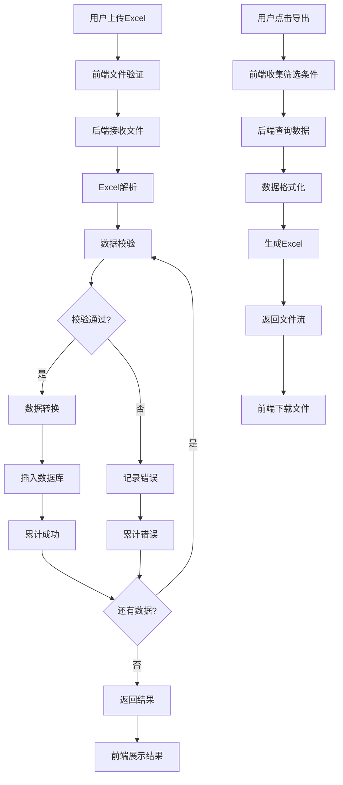

# 零售合同管理 - 导入导出功能实现计划

## 一、项目概述

### 1.1 实现目标

基于现有的零售合同管理模块，实现完整的Excel导入导出功能，支持：
- 标准Excel格式的批量数据导入
- 灵活的筛选条件导出
- 完善的数据校验和错误处理
- 优秀的用户体验和性能表现

### 1.2 当前状态

**已完成**：
- ✅ 完整的CRUD基础功能
- ✅ 数据模型和业务逻辑
- ✅ 前端界面和交互
- ✅ 移动端响应式支持

**待实现**：
- ❌ Excel导入功能
- ❌ Excel导出功能
- ❌ 批量数据处理能力

### 1.3 技术栈

- **后端**：FastAPI + Pydantic + MongoDB + pandas + openpyxl
- **前端**：React + TypeScript + Material-UI + Axios
- **数据处理**：pandas（Excel处理）+ openpyxl（文件生成）

## 二、实施计划

### 2.1 总体时间安排

| 阶段 | 功能模块 | 预计工时 | 开始时间 | 结束时间 |
|------|---------|---------|---------|---------|
| 阶段一 | 环境准备与依赖安装 | 0.5天 | 第1天上午 | 第1天上午 |
| 阶段二 | 后端导入功能开发 | 1.5天 | 第1天下午 | 第2天下午 |
| 阶段三 | 后端导出功能开发 | 1天 | 第3天上午 | 第3天下午 |
| 阶段四 | 前端功能开发 | 2天 | 第4天上午 | 第5天下午 |
| 阶段五 | 集成测试与优化 | 1天 | 第6天上午 | 第6天下午 |
| **合计** | **全功能实现** | **6天** | - | - |

### 2.2 详细任务分解

#### 阶段一：环境准备与依赖安装（0.5天）

**任务1.1：检查和安装Python依赖**
```bash
# 检查现有依赖
pip list | grep -E "pandas|openpyxl|python-multipart"

# 安装缺失依赖
pip install pandas>=1.5.0 openpyxl>=3.0.0 python-multipart>=0.0.5

# 更新requirements.txt
echo "pandas>=1.5.0" >> webapp/requirements.txt
echo "openpyxl>=3.0.0" >> webapp/requirements.txt
echo "python-multipart>=0.0.5" >> webapp/requirements.txt
```

**任务1.2：创建Excel处理工具模块**
- 创建 `webapp/utils/excel_handler.py`
- 封装常用的Excel读写和格式化功能
- 编写单元测试

**任务1.3：准备测试数据**
- 根据交易中心标准格式创建测试Excel文件
- 准备各种边界情况的测试数据
- 建立测试数据集

#### 阶段二：后端导入功能开发（1.5天）

**任务2.1：实现Excel读取和解析**
```python
# webapp/utils/excel_handler.py
class ExcelReader:
    def read_excel_file(self, file_content: bytes) -> pd.DataFrame
    def validate_excel_structure(self, df: pd.DataFrame) -> bool
    def parse_row_data(self, row: pd.Series, row_number: int) -> dict
```

**任务2.2：实现数据校验逻辑**
```python
# webapp/services/contract_import_service.py
class ContractImportService:
    def validate_required_fields(self, row: pd.Series) -> List[Dict]
    def validate_data_types(self, row: pd.Series) -> List[Dict]
    def validate_related_data(self, row: pd.Series) -> List[Dict]
    def validate_business_rules(self, row: pd.Series) -> List[Dict]
    def transform_row_to_contract(self, row: pd.Series, operator: str) -> dict
```

**任务2.3：实现导入API端点**
```python
# webapp/api/v1_retail_contracts.py
@router.post("/import", summary="导入合同数据")
async def import_contracts(
    file: UploadFile = File(...),
    current_user: User = Depends(get_current_active_user)
):
    # 导入处理逻辑
    pass
```

**任务2.4：实现合同名称生成**
- 客户简称查询逻辑
- 合同名称格式化
- 重复性检查

**任务2.5：编写单元测试**
- Excel解析测试
- 数据校验测试
- 业务逻辑测试

#### 阶段三：后端导出功能开发（1天）

**任务3.1：实现数据查询和筛选**
```python
# webapp/services/contract_export_service.py
class ContractExportService:
    def build_export_query(self, params: dict) -> dict
    def query_contracts_data(self, query: dict) -> List[dict]
    def format_contract_data(self, contract: dict) -> dict
    def calculate_contract_status(self, contract: dict) -> str
```

**任务3.2：实现Excel文件生成**
```python
# webapp/utils/excel_generator.py
class ExcelGenerator:
    def create_workbook(self) -> Workbook
    def add_data_sheet(self, data: List[dict], sheet_name: str)
    def apply_styling(self, worksheet: Worksheet)
    def auto_adjust_columns(self, worksheet: Worksheet)
    def save_to_bytes(self) -> BytesIO
```

**任务3.3：实现导出API端点**
```python
@router.get("/export", summary="导出合同数据")
async def export_contracts(
    package_name: Optional[str] = Query(None),
    customer_name: Optional[str] = Query(None),
    status: Optional[str] = Query(None),
    # ... 其他筛选参数
    current_user: User = Depends(get_current_active_user)
):
    # 导出处理逻辑
    pass
```


#### 阶段四：前端功能开发（2天）

**任务4.1：创建导入对话框组件**
```typescript
// frontend/src/components/ContractImportDialog.tsx
interface ContractImportDialogProps {
  open: boolean;
  onClose: () => void;
  onSuccess: (result: ImportResult) => void;
}
```

**任务4.2：实现文件上传功能**
- 文件选择和预览
- 上传进度显示
- 文件格式验证

**任务4.3：创建导出对话框组件**
```typescript
// frontend/src/components/ContractExportDialog.tsx
interface ContractExportDialogProps {
  open: boolean;
  onClose: () => void;
  currentFilters: any;
}
```

**任务4.4：实现筛选条件界面**
- 套餐选择器
- 客户选择器
- 状态筛选器
- 日期范围选择器

**任务4.5：集成到主页面**
```typescript
// frontend/src/pages/RetailContractPage.tsx
// 添加导入导出按钮和相关状态管理
```

**任务4.6：实现结果展示组件**
```typescript
// frontend/src/components/ImportResultDialog.tsx
interface ImportResultDialogProps {
  open: boolean;
  result: ImportResult;
  onClose: () => void;
}
```

#### 阶段五：集成测试与优化（1天）

**任务5.1：端到端测试**
- 完整导入流程测试
- 完整导出流程测试
- 错误场景测试

**任务5.2：性能测试**
- 大数据量导入测试（1000+行）
- 大数据量导出测试
- 内存使用监控

**任务5.3：用户体验优化**
- 移动端适配测试
- 加载状态优化
- 错误提示优化

**任务5.4：文档编写**
- API文档更新
- 用户使用手册
- 开发者文档

## 三、技术实现细节

### 3.1 后端架构设计

```
webapp/
├── api/v1_retail_contracts.py     # API路由端点
├── services/
│   ├── contract_service.py         # 现有业务服务
│   ├── contract_import_service.py  # 导入业务逻辑
│   └── contract_export_service.py  # 导出业务逻辑
├── utils/
│   ├── excel_handler.py           # Excel处理工具
│   └── excel_generator.py         # Excel生成工具
└── models/
    └── contract.py                 # 数据模型（现有）
```

### 3.2 前端组件架构

```
frontend/src/
├── pages/RetailContractPage.tsx    # 主页面（需修改）
├── components/
│   ├── ContractImportDialog.tsx    # 导入对话框
│   ├── ContractExportDialog.tsx    # 导出对话框
│   ├── ImportResultDialog.tsx      # 导入结果展示
│   └── ContractEditorDialog.tsx    # 现有编辑对话框
├── api/
│   └── retail-contracts.ts         # API客户端（需扩展）
└── types/
    └── contract.ts                 # 类型定义（需扩展）
```

### 3.3 数据流程图



## 四、质量保证计划

### 4.1 代码质量标准

**Python代码规范**：
- 遵循PEP 8规范
- 使用类型提示
- 编写完整的docstring
- 单元测试覆盖率 > 80%

**TypeScript代码规范**：
- 使用严格类型检查
- 遵循项目代码风格
- 组件必须有PropTypes/TypeScript接口
- 错误处理完整

### 4.2 测试策略

**单元测试**：
```python
# 测试数据校验
def test_validate_required_fields():
    # 测试必填项校验
    pass

def test_validate_package_exists():
    # 测试套餐存在性校验
    pass

# 测试Excel处理
def test_parse_excel_file():
    # 测试Excel文件解析
    pass

def test_generate_excel_file():
    # 测试Excel文件生成
    pass
```

**集成测试**：
```python
# 测试完整导入流程
def test_import_contracts_integration():
    # 创建测试Excel文件
    # 调用导入API
    # 验证数据库结果
    pass

# 测试完整导出流程
def test_export_contracts_integration():
    # 创建测试数据
    # 调用导出API
    # 验证导出文件
    pass
```

**前端测试**：
```typescript
// 组件单元测试
describe('ContractImportDialog', () => {
  it('should render import dialog correctly', () => {
    // 测试组件渲染
  });

  it('should handle file upload correctly', () => {
    // 测试文件上传
  });
});

// API集成测试
describe('Contract API', () => {
  it('should import contracts successfully', async () => {
    // 测试导入API
  });

  it('should export contracts correctly', async () => {
    // 测试导出API
  });
});
```

### 4.3 性能基准

**导入性能**：
- 100行数据： < 2秒
- 1000行数据： < 10秒
- 5000行数据： < 30秒

**导出性能**：
- 100行数据： < 1秒
- 1000行数据： < 5秒
- 5000行数据： < 15秒

**内存使用**：
- 导入时内存峰值 < 200MB
- 导出时内存峰值 < 100MB
- 无明显内存泄漏

## 五、风险管理

### 5.1 技术风险

| 风险项 | 风险等级 | 影响 | 缓解措施 |
|--------|---------|------|---------|
| Excel格式兼容性 | 中 | 导入失败 | 支持多种Excel版本，充分测试 |
| 大文件处理性能 | 中 | 用户体验差 | 分批处理，流式处理 |
| 数据库性能影响 | 低 | 系统响应慢 | 优化查询，添加索引 |
| 内存溢出 | 中 | 系统崩溃 | 流式处理，限制文件大小 |

### 5.2 业务风险

| 风险项 | 风险等级 | 影响 | 缓解措施 |
|--------|---------|------|---------|
| 数据校验不严格 | 高 | 脏数据 | 多层校验，详细错误提示 |
| 用户操作错误 | 中 | 数据错误 | 提供详细错误提示，操作指导 |
| 权限控制不足 | 中 | 数据安全 | JWT认证，操作审计 |

### 5.3 应急预案

**导入失败处理**：
1. 提供详细的错误日志
2. 支持部分成功导入
3. 提供数据回滚机制
4. 生成错误报告供用户修正

**导出失败处理**：
1. 提供友好的错误提示
2. 支持重试机制
3. 记录失败原因
4. 提供替代导出方案

## 六、部署计划

### 6.1 开发环境部署

**步骤1：后端部署**
```bash
# 1. 安装依赖
pip install -r webapp/requirements.txt

# 2. 运行测试
pytest tests/test_import_export.py

# 3. 启动服务
uvicorn webapp.main:app --reload --host 0.0.0.0 --port 8005
```

**步骤2：前端部署**
```bash
# 1. 安装依赖
npm install

# 2. 启动开发服务器
npm start

# 3. 验证功能
# 访问 http://localhost:3000 测试导入导出功能
```

### 6.2 生产环境部署

**步骤1：依赖安装**
```bash
# 生产环境安装依赖
pip install pandas openpyxl python-multipart
```

**步骤2：配置调整**
- 文件上传大小限制
- 超时时间设置
- 内存限制配置

**步骤3：监控配置**
- 导入导出操作日志
- 性能监控指标
- 错误报警机制

## 七、验收标准

### 7.1 功能验收标准

**导入功能**：
- ✅ 支持标准Excel格式(.xlsx, .xls)
- ✅ 字段映射准确（套餐→package_name等）
- ✅ 数据校验完整（必填项、格式、业务规则）
- ✅ 错误处理友好（详细错误信息，修改建议）
- ✅ 支持部分成功导入
- ✅ 合同名称自动生成

**导出功能**：
- ✅ 支持多种筛选条件导出
- ✅ Excel格式规范（列名、格式、样式）
- ✅ 数据完整准确
- ✅ 状态显示中文
- ✅ 支持大数据量导出

### 7.2 性能验收标准

- ✅ 100行数据导入 < 2秒
- ✅ 1000行数据导入 < 10秒
- ✅ 1000行数据导出 < 5秒
- ✅ 内存使用稳定，无泄漏

### 7.3 用户体验验收标准

- ✅ 操作流程简单直观
- ✅ 进度反馈及时准确
- ✅ 错误提示清晰友好
- ✅ 支持移动端操作
- ✅ 响应时间合理

## 八、后续优化计划

### 8.1 短期优化（1个月内）

1. **异步导入支持**：大文件异步处理，提供进度查询
2. **更多导出格式**：支持CSV、PDF等格式
3. **导入功能优化**：提供更详细的错误提示和修复建议
4. **批量操作增强**：支持批量更新、删除

### 8.2 中期优化（3个月内）

1. **智能数据匹配**：模糊匹配客户和套餐名称
2. **导入历史记录**：记录导入历史，支持回滚
3. **定时导出**：支持定时自动导出功能
4. **数据可视化**：导入导出数据统计图表

### 8.3 长期优化（6个月内）

1. **AI辅助校验**：使用机器学习识别和修正数据错误
2. **多文件导入**：支持同时导入多个Excel文件
3. **云端存储**：支持将导出文件保存到云存储
4. **API开放**：提供导入导出功能的开放API

## 九、总结

本实现计划为零售合同管理模块的导入导出功能提供了详细的实施方案，包括：

1. **清晰的时间安排**：6天完成全功能开发
2. **详细的任务分解**：每个阶段都有具体的任务和交付物
3. **完整的技术方案**：涵盖前后端架构和实现细节
4. **全面的质量保证**：测试策略和验收标准
5. **有效的风险管理**：识别风险并制定缓解措施
6. **可行的部署方案**：开发和生产环境部署指南

通过严格按照此计划执行，可以确保导入导出功能的高质量实现，为用户提供优秀的数据管理体验。