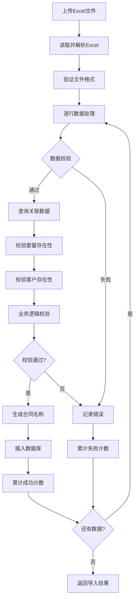

# 零售合同管理模块 - 导入导出功能设计方案

> **更新说明**: 本方案根据当前代码实现和新的业务需求进行了调整，重点关注Excel导入导出功能的实际字段映射和处理逻辑。

## 一、当前状态分析

### 1.1 现有代码结构

根据代码分析，零售合同管理模块已具备：

**后端实现**：
- ✅ 完整的CRUD API (`webapp/api/v1_retail_contracts.py`)
- ✅ 业务服务层 (`webapp/services/contract_service.py`)
- ✅ 数据模型定义 (`webapp/models/contract.py`)
- ✅ 状态管理（待生效、生效、已过期）

**前端实现**：
- ✅ 列表页面 (`frontend/src/pages/RetailContractPage.tsx`)
- ✅ 编辑对话框 (`frontend/src/components/ContractEditorDialog.tsx`)
- ✅ 详情对话框 (`frontend/src/components/ContractDetailsDialog.tsx`)
- ✅ API客户端 (`frontend/src/api/retail-contracts.ts`)
- ✅ 移动端响应式支持

**数据模型**：
```typescript
interface Contract {
  id: string;
  contract_name: string;        // 合同名称（自动生成：客户简称+年月）
  package_name: string;         // 套餐名称
  package_id: string;           // 套餐ID
  customer_name: string;        // 客户名称
  customer_id: string;          // 客户ID
  purchasing_electricity_quantity: number;  // 购买电量
  purchase_start_month: string; // 购电开始月份
  purchase_end_month: string;   // 购电结束月份
  status: 'pending' | 'active' | 'expired';  // 虚拟状态字段
  created_at: string;
  updated_at: string;
}
```

### 1.2 需要实现的功能

- ❌ Excel导入功能
- ❌ Excel导出功能

## 二、Excel导入功能设计

### 2.1 导入字段映射

根据新的业务需求，Excel文件字段与系统字段映射关系：

| Excel字段名 | 系统字段名 | 数据类型 | 必填 | 处理逻辑 |
|------------|-----------|---------|------|---------|
| 序号 | - | 数字 | 否 | **忽略**，仅用于Excel内排序 |
| 套餐 | package_name | 文本 | 是 | 模糊匹配套餐名称 |
| 代理销售费模型 | - | 文本 | 否 | **忽略**，系统自动从套餐获取 |
| 购买用户 | customer_name | 文本 | 是 | 精确匹配客户名称 |
| 购买电量 | purchasing_electricity_quantity | 数字 | 是 | 直接存储 |
| 购买时间-开始 | purchase_start_month | 日期 | 是 | 转换为月份首日 |
| 购买时间-结束 | purchase_end_month | 日期 | 是 | 转换为月份首日 |
| 签章状态 | - | 文本 | 否 | **忽略**，系统不存储此信息 |

### 2.2 导入处理流程



### 2.3 数据校验规则

**1. 基础校验**
```python
required_fields = ['套餐', '购买用户', '购买电量', '购买时间-开始', '购买时间-结束']
```

**2. 数据格式校验**
- 购买电量：必须为数字且 > 0
- 日期字段：支持多种格式（YYYY-MM、YYYY-MM-DD、YYYY/MM、YYYY/MM/DD）

**3. 关联数据校验**
- 套餐名称：必须在 `retail_packages` 中存在且状态为 active
- 客户名称：必须在 `customers` 中存在且状态为 active

**4. 业务逻辑校验**
- 购买结束月份 >= 购买开始月份
- 同一客户在相同时间段不能有重复合同

### 2.4 合同名称生成规则

导入时自动生成合同名称：`客户简称 + 购电开始年月`
- 示例：恒力集团202401、超胜塑业202406
- 优先使用客户的 `short_name` 字段
- 如果没有简称，使用客户名称前4个字符

## 三、Excel导出功能设计

### 3.1 导出字段映射

| 系统字段名 | Excel字段名 | 数据格式 | 说明 |
|-----------|------------|---------|------|
| contract_name | 合同名称 | 文本 | 系统生成的合同名称 |
| package_name | 套餐名称 | 文本 | 关联的套餐名称 |
| customer_name | 购买用户 | 文本 | 客户名称 |
| purchasing_electricity_quantity | 购买电量 | 数字 | 保留2位小数 |
| purchase_start_month | 购买时间-开始 | 日期 | YYYY-MM格式 |
| purchase_end_month | 购买时间-结束 | 日期 | YYYY-MM格式 |
| status | 合同状态 | 文本 | 中文显示（待生效/生效/已过期） |
| created_at | 创建时间 | 日期时间 | YYYY-MM-DD HH:MM:SS格式 |

### 3.2 筛选条件支持

导出功能支持按以下条件筛选：
- 套餐名称（模糊搜索）
- 购买用户（模糊搜索）
- 合同状态（待生效/生效/已过期）
- 购电时间范围（开始月份-结束月份）

### 3.3 导出文件格式

- 文件格式：Excel (.xlsx)
- 文件命名：`零售合同数据_YYYYMMDD_HHMMSS.xlsx`
- 表格样式：
  - 自动调整列宽
  - 冻结首行
  - 添加筛选器
  - 状态列使用颜色标记

## 四、技术实现方案

### 4.1 后端实现

**依赖库**：
```python
pandas>=1.5.0          # Excel处理
openpyxl>=3.0.0         # Excel读写引擎
python-multipart>=0.0.5 # 文件上传支持
```

**导入API端点**：
```python
@router.post("/import", summary="导入合同数据")
async def import_contracts(
    file: UploadFile = File(...),
    current_user: User = Depends(get_current_active_user)
):
    """Excel导入合同数据，支持批量处理和错误报告"""
```

**导出API端点**：
```python
@router.get("/export", summary="导出合同数据")
async def export_contracts(
    package_name: Optional[str] = None,
    customer_name: Optional[str] = None,
    status: Optional[str] = None,
    start_month: Optional[str] = None,
    end_month: Optional[str] = None,
    current_user: User = Depends(get_current_active_user)
):
    """导出合同数据为Excel文件，支持筛选条件"""
```

### 4.2 前端实现

**导入对话框组件**：
```typescript
interface ContractImportDialogProps {
  open: boolean;
  onClose: () => void;
  onSuccess: (result: ImportResult) => void;
}

interface ImportResult {
  total: number;
  success: number;
  failed: number;
  errors: ImportError[];
}
```

**导出功能**：
```typescript
const handleExport = async (filters: ExportFilters) => {
  const response = await contractApi.export(filters);
  // 处理文件下载
  downloadFile(response.data, `零售合同数据_${formatDate(new Date())}.xlsx`);
};
```

## 五、错误处理机制

### 5.1 导入错误类型

| 错误类型 | 错误代码 | 示例 | 处理方式 |
|---------|---------|------|---------|
| 文件格式错误 | INVALID_FILE_FORMAT | 文件不是有效的Excel格式 | 终止导入，返回错误 |
| 缺少必填列 | MISSING_REQUIRED_COLUMNS | 缺少列：套餐名称 | 终止导入，返回错误 |
| 数据格式错误 | DATA_FORMAT_ERROR | 购买电量必须为数字 | 记录行级错误 |
| 关联数据不存在 | RELATED_DATA_NOT_FOUND | 套餐不存在或未生效 | 记录行级错误 |
| 业务逻辑错误 | BUSINESS_LOGIC_ERROR | 结束月份早于开始月份 | 记录行级错误 |

### 5.2 错误信息格式

```typescript
interface ImportError {
  row: number;           // Excel行号（从2开始）
  field: string;         // 字段名
  value: any;           // 错误值
  message: string;       // 错误描述
  suggestion?: string;   // 修改建议（可选）
}
```

## 六、测试方案

### 6.1 导入测试用例

**测试数据**：
```
序号,套餐,代理销售费模型,购买用户,购买电量,购买时间-开始,购买时间-结束,签章状态
1,2024年商业尖峰平谷套餐,标准模式,丰城超胜塑业有限公司,100000,2024-01,2024-12,已签章
2,不存在的套餐,标准模式,丰城超胜塑业有限公司,50000,2024-06,2024-12,已签章
3,2024年商业尖峰平谷套餐,标准模式,不存在的客户,-1000,2024-01,2024-12,未签章
```

**预期结果**：
- 第1行：成功导入
- 第2行：失败（套餐不存在）
- 第3行：失败（客户不存在且购买电量 <= 0）

### 6.2 导出测试用例

1. **全量导出**：导出所有合同数据
2. **筛选导出**：按状态、套餐、客户筛选导出
3. **空数据导出**：无匹配数据时导出空表格
4. **大数据导出**：测试1000+条记录的导出性能

## 七、性能优化

### 7.1 导入优化

- **批量处理**：每100行为一批，分批插入数据库
- **内存管理**：使用流式读取，避免大文件内存溢出
- **索引优化**：确保套餐名称和客户名称有索引
- **异步处理**：对于超大文件，考虑异步导入方案

### 7.2 导出优化

- **分页查询**：大数据量时分页查询避免内存溢出
- **流式写入**：使用流式Excel写入，减少内存占用
- **缓存查询**：相同筛选条件缓存查询结果

## 八、实施计划

### 8.1 开发阶段

**阶段1：后端API开发（预计2天）**
1. 安装和配置依赖库
2. 实现Excel导入API端点
3. 实现Excel导出API端点
4. 单元测试和API测试

**阶段2：前端功能开发（预计2天）**
1. 开发导入对话框组件
2. 实现文件上传和预览
3. 集成导出功能
4. 错误展示和用户反馈

**阶段3：集成测试（预计1天）**
1. 端到端测试
2. 性能测试
3. 边界情况测试
4. 用户体验优化

### 8.2 验收标准

**功能验收**：
- ✅ 支持标准Excel格式导入导出
- ✅ 字段映射准确无误
- ✅ 数据校验完整有效
- ✅ 错误信息清晰友好
- ✅ 支持筛选条件导出

**性能验收**：
- ✅ 100行数据导入 < 5秒
- ✅ 1000行数据导出 < 10秒
- ✅ 内存使用稳定，无明显泄漏

**用户体验验收**：
- ✅ 操作流程简单直观
- ✅ 进度反馈及时准确
- ✅ 错误提示易于理解
- ✅ 支持移动端操作

## 九、风险控制

### 9.1 技术风险

- **文件格式兼容性**：支持多种Excel版本格式
- **大数据量处理**：设置合理的文件大小限制
- **并发导入**：避免同时导入多个文件造成数据冲突

### 9.2 数据安全

- **权限控制**：导入导出需要登录认证
- **数据校验**：严格校验输入数据，防止脏数据
- **操作日志**：记录所有导入导出操作

### 9.3 业务风险

- **重复导入**：提供数据去重机制
- **数据覆盖**：明确导入是增量还是覆盖模式
- **回滚机制**：提供错误数据的批量回滚功能

---

## 十、总结

本导入导出功能设计方案充分考虑了当前代码架构和新的业务需求，通过合理的字段映射、严格的校验机制和友好的用户界面，为零售合同管理模块提供高效的数据批量处理能力。

关键特点：
1. **字段映射灵活**：适配业务变化的Excel格式
2. **校验机制完善**：确保数据质量和业务规则
3. **用户体验友好**：提供清晰的错误提示和操作反馈
4. **性能优化良好**：支持大数据量的高效处理
5. **扩展性强**：为未来功能扩展预留接口